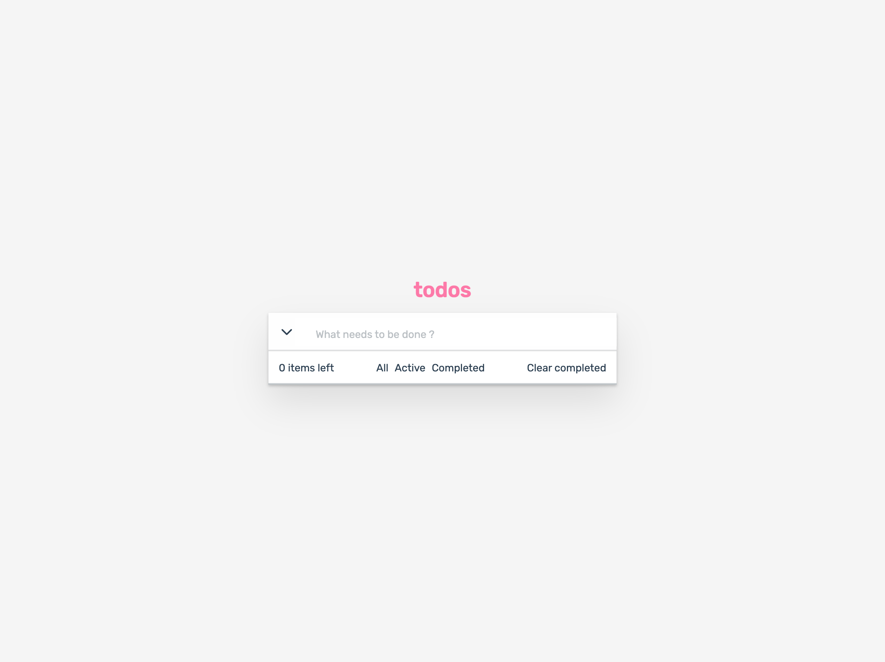

# React Todo Hooks

A task manager app built with React hooks. Todos are stored in localStorage.

#### Packages I use.
- sass
- sass-loader
- react-icons

`git clone https://github.com/ibrahimgediktr/react-todo-hooks `

#### `yarn install`

#### `yarn start`

Runs the app in the development mode.\
Open [http://localhost:3000](http://localhost:3000) to view it in the browser.
